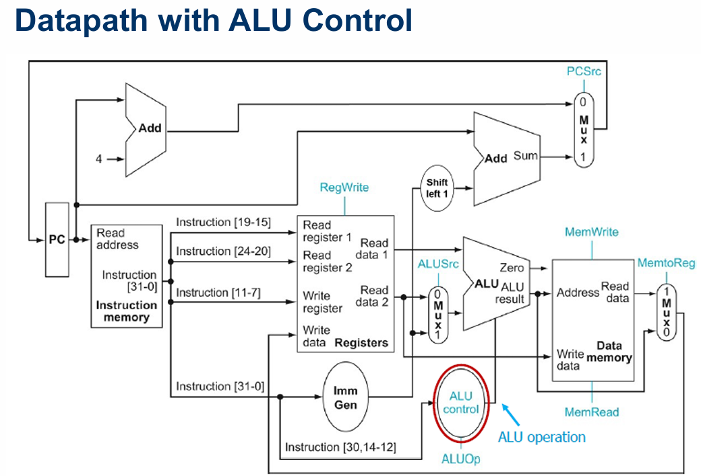

# RISC-V Single-Cycle Core

A 32-bit RISC-V single-cycle processor implementation designed for educational and architectural understanding.  
The processor integrates datapath, control unit, instruction memory, and data memory into a complete system capable of executing a substantial subset of the RV32I instruction set.

---

## Datapath with ALU Control

## System-Level Architecture

The top-level system integrates:

- A **single-cycle processor core**
- **Instruction Memory** (program storage)
- **Data Memory** (data storage)

All instructions complete in **one clock cycle**, prioritizing simplicity over performance.

Top module:
single_cycle_top

---

## Module Hierarchy

single_cycle_top
└── Single_Cycle_Core
├── Core_Datapath
│ ├── PC
│ ├── Pc_Plus_4
│ ├── PC_Mux
│ ├── REG_MEM_BLOCK
│ ├── Extend
│ ├── ALU_Mux
│ ├── ALU
│ └── Result_Mux
├── Control_unit
│ ├── Main_Decoder
│ └── ALUDecoder
├── Instruction_Memory
└── Data_mem

---

## Top-Level Module (`single_cycle_top`)

**Purpose**  
System integration module connecting the processor core with instruction and data memories.

**Key Features**

- Clock and reset distribution
- Memory interfacing
- External visibility of key internal signals for debugging

---

## Core Datapath (`Core_Datapath`)

**Purpose**  
Implements instruction execution and data movement.

**Key Features**

- 32-bit Program Counter with branch and jump support
- 32-register register file (x0 hardwired to zero)
- Immediate extension for I, S, B, U, J formats
- ALU with multiple arithmetic and logical operations
- Write-back multiplexing

---

## Control Unit (`Control_unit`)

**Purpose**  
Generates control signals based on instruction opcode and function fields.

**Responsibilities**

- Instruction decoding
- ALU operation selection
- Branch and jump decision logic
- Memory access control

Submodules:

- `Main_Decoder`
- `ALUDecoder`

---

## ALU (Arithmetic Logic Unit)

**Supported Operations**

- ADD, SUB
- AND, OR, XOR
- SLT, SLTU
- Shift left, logical right, arithmetic right
- LUI, AUIPC

Outputs:

- Result
- Zero flag (for branch decisions)

---

## Instruction Memory

**Features**

- Word-addressable, combinational read
- Preloaded with a **Fibonacci sequence program**
- 81-word capacity (demo-scale)

Used to demonstrate:

- Arithmetic operations
- Register updates
- Memory stores

---

## Data Memory

**Features**

- 64-word capacity
- Word-aligned access only
- Synchronous write, combinational read

---

## Instruction Set Support (RV32I Subset)

### R-Type

ADD, SUB, AND, OR, XOR, SLT, SLTU, SLL, SRL, SRA

### I-Type

ADDI, ANDI, ORI, XORI, SLTI, SLTIU, LW, JALR

### S-Type

SW

### B-Type

BEQ, BNE

### U-Type

LUI, AUIPC

### J-Type

JAL

---

## Design Notes (Be Honest)

- Single-cycle design → **inefficient but simple**
- No pipelining, no hazard handling
- Intended for **learning**, not performance
- Not synthesis-optimized

---
